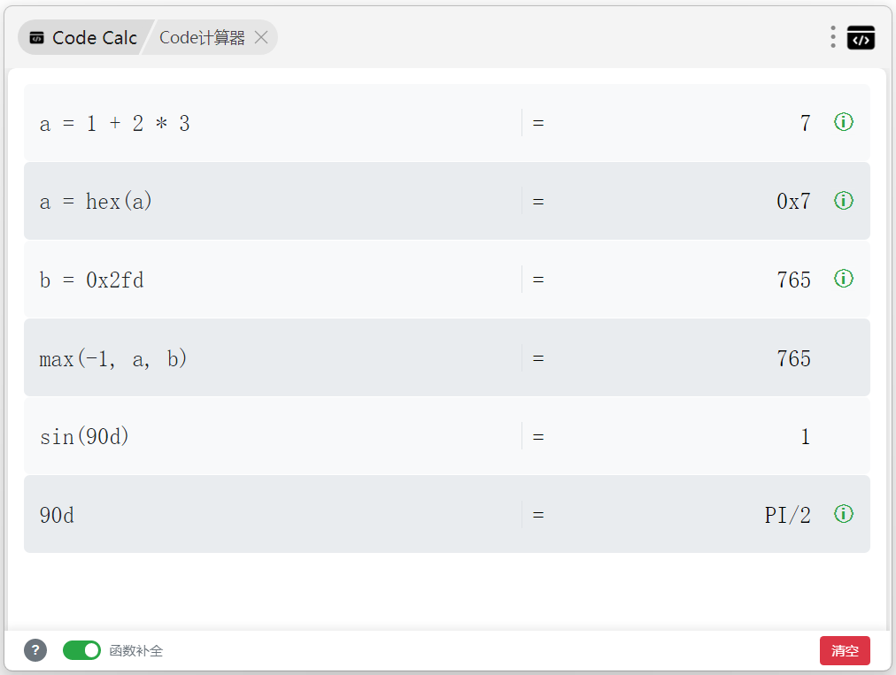

# CodeCalc 

一个utools 插件，支持在计算器功能中添加代码.

## 主要功能如下

### 变量：
- `a = 2 x 3`
- `b = a + 1`

### 默认常数：
- `PI=3.14159`, `e=2.71828`

### 基本运算：
- `+`, `-`, `* x X`, `/`, `//`(整除), `%`(余数), `**`(幂)
- `+=`、`-=`、`*=`、`/=`

### 角度转换弧度：角度值 + d 转为弧度
- `30d = 30 * PI / 180`
- `sin(45d) = sin(45 * PI / 180)`

### 数学函数：
- 三角函数：`sin(45d)`, `cos(PI/2)`, `tan(PI/4)`
- 反三角函数：`asin(0.5)`, `acos(0)`, `atan(1)`
- `log(100)`, `ln(e)`, `exp(2)=e**2`
- `sqrt(2)`, `root(8,3)=2`, `pow(2,3)=8`
- `max(1,2,3)=3`, `min(1,2,3)=1`

### 进制：
- 其它进制转十进制：`0b111`, `0o111`, `0x111`
- 十进制转其它进制：`bin(111)`, `oct(111)`, `hex(111)`

### 备注
这个插件灵感来源于：[itribs/rcalculator](https://github.com/itribs/rcalculator)
