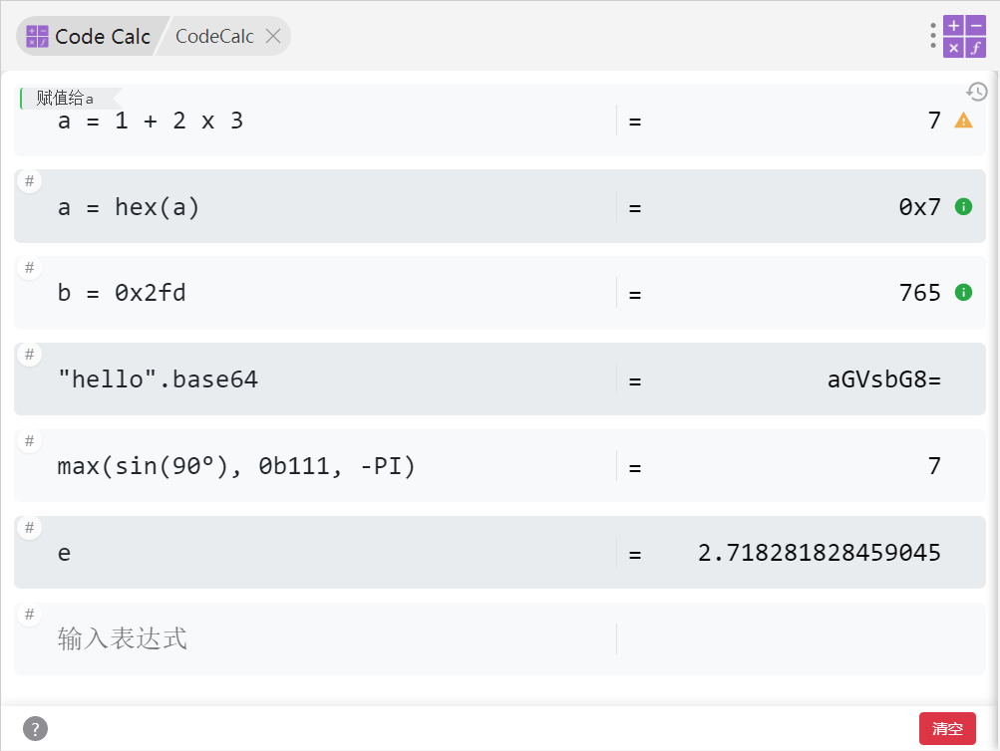

# CodeCalc 

一个支持代码风格计算的 utools 插件。

## 主要功能

### 变量和赋值：
- 基本赋值：`a = 5`
- 复合赋值：`+=`, `-=`, `*=`, `/=`, `%=`, `&=`, `|=`, `^=`, `<<=`, `>>=`, `>>>=`

### 基本运算：
- 算术运算：`+`, `-`, `*`, `/`, `//`, `%`, `**`
- 位运算：`&`, `|`, `^`, `~`, `<<`, `>>`, `>>>`
- 别名支持：`and`, `or`, `not`, `x`(未定义变量`x`时可以用作乘号)

### 数学函数：
- 三角函数：`sin`, `cos`, `tan`, `asin`, `acos`, `atan`
- 对数指数：`log`, `ln`, `exp`, `pow`, `sqrt`
- 其他：`abs`, `max`, `min`

### 字符串操作：
- 字符串：`s = "Hello"`, 支持 `+` 连接，如 `"Hello" + "World"`
- 字符串属性：`.length`, `.upper`, `.lower`
- base64 编解码：`base64(s)` 或 `.base64`, `unbase64(s)` 或  `.unbase64`

### 角度转换：
- 度数：`deg(45)` 或 `45°` 或 `.deg`
- 弧度：`rad(PI)` 或 `.rad`

### 进制转换：
- 输入：`0b`(二进制), `0o`(八进制), `0x`(十六进制)
- 输出：`.bin`, `.oct`, `.hex`

### 常量：
- `PI`: 3.14159...
- `e`: 2.71828...

### 备注
灵感来源：[itribs/rcalculator](https://github.com/itribs/rcalculator)
